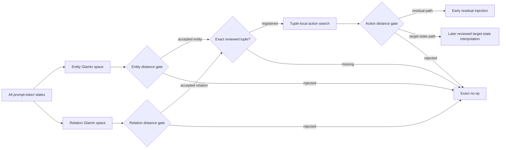
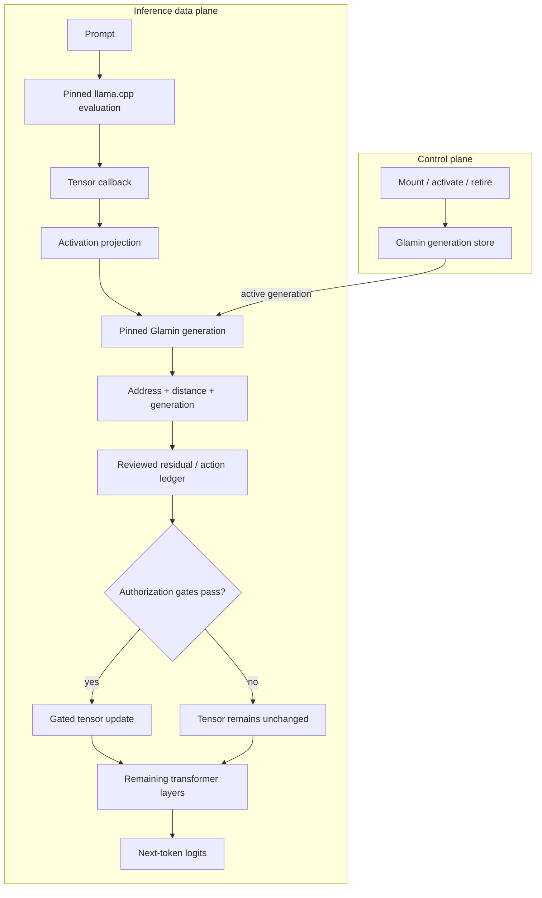

# Glamin Experiment 1

## Executable associative memory inside transformer inference

Glamin Experiment 1 is a research prototype for studying whether persistent,
executable vector geometry can participate directly in language-model
inference. It integrates a C++17 host, a pinned `llama.cpp` inference graph, and
the Fortran-based [Glamin](https://github.com/LynnColeArt/glamin) runtime through
a versioned C ABI.

The project is deliberately narrower than a general agent-memory framework. It
does not retrieve documents into a prompt and it does not modify model weights.
Instead, a callback intercepts named transformer tensors, derives an address
from live hidden states, searches an immutable Glamin generation, and applies
an authorized residual or later target state before resuming the same model
evaluation.

> **Research status:** experimental. The repository establishes several small,
> reproducible mechanisms and records their failures as well as their successes.
> It is not a production memory system, a safety-certified action runtime, or
> evidence of broad factual recall.

## Abstract

Contemporary language-model memory systems usually operate outside inference:
an application retrieves text, inserts it into a context window, and invokes a
model whose persistent state remains unchanged. This project investigates a
different boundary. We ask whether an approximate-nearest-neighbor runtime can
act as a persistent, dynamically replaceable component of the model's forward
computation while retaining explicit generation, provenance, and abstention
semantics.

The implemented system projects transformer activations into Glamin-owned
spaces, retrieves generation-pinned addresses, resolves reviewed host-side
actions, and injects bounded residuals before inference continues. Successive
experiments establish: (1) live geometry activation and deterministic rollback;
(2) activation-derived associative recall with distance-gated abstention; and
(3) a factorized entity–relation–action join that separates broad semantic
evidence from authority to apply a specific memory action.

The latest probe replaces one broad authorization signal with separate tuple
compatibility and global retrieval-intent decisions. Both passed their frozen
local criteria: 12/12 compatibility positives, 60/60 cross-tuple rejections,
12/12 intent positives, and 36/36 eligible negative no-ops. Their composition
reached 11/12 rank-one targets and rejected 17/18 new wrong intents, while all
30 earlier wrong-intent regressions remained no-ops. One counterfactual was
authorized, one unseen retrieval form was rejected, and one unknown entity
passed its factor gate, so the all-or-nothing composition criterion failed and
persistence remains deferred.

## Research questions

The repository is organized around four falsifiable questions:

1. Can a C++ process mount, activate, pin, retire, and restore Glamin geometry
   without restarting or invalidating in-flight readers?
2. Can a live transformer activation address an external associative memory and
   receive a result inside the same forward pass?
3. Can distance boundaries make nearest-neighbor memory fail closed on
   unrelated or unauthorized contexts?
4. Can broad entity and relation evidence be composed while specific action
   authority remains restricted to reviewed tuples and compatible intents?

The intended inference operation is:

```text
q             = project_in(h_address)
selection     = glamin_search(q, pinned_generation)
authorized_r  = reviewed_action(selection, request_state)
h_action'     = h_action + gate * authorized_r
```

The factorized probe refines `reviewed_action` into a bounded join:



Failure at any gate leaves the hooked tensor unchanged.

## Contributions of the prototype

This repository currently provides:

- a C++ RAII wrapper over Glamin's Fortran/C runtime boundary;
- immutable geometry generations with atomic activation, stable request pins,
  retirement, and rollback;
- compiler-artifact loading with selected-space contract validation;
- a pinned `llama.cpp` tensor callback for reading and modifying live hidden
  states;
- a hash-bound `gx1-hook-v1` artifact joining the model/layer contract,
  projection, Glamin index, address-selection policy, and residual payloads;
- a model-agnostic activation-memory builder that derives keys and
  teacher-minus-query actions from grouped forward passes;
- variance, association-signal, and contrastive authorization-signal
  projection strategies;
- selected-view and normalized association-centroid key construction;
- global and runtime-topology-aware gate calibration;
- factorized entity and relation search, an exact tuple ledger, and a
  tuple-local action gate;
- authorization-only factorized lookup, a reviewed target-state ledger, and a
  two-tensor callback for later action; and
- executable probes that distinguish construction, development, frozen
  evaluation, negative controls, and deliberately missing tuples.

No gradient-based training is performed. “Construction” and “calibration” in
this repository refer to deriving geometry and thresholds from frozen-model
activations, not updating neural weights.

## System architecture



The real-model probes address Qwen3 at `l_out-34`, where all prompt-token rows
remain available. The residual baseline acts on that tensor's final row. The
two-stage path authorizes there without mutation and, if accepted, interpolates
the final row of `l_out-35` to a reviewed tuple target state. The model, tensor
names, hidden width, projection, selection policy, Glamin space, payloads, and
distance boundary are treated as one compatibility contract.

Glamin indexes are used for geometric search. Exact tuple membership,
generation-qualified payload resolution, and external authority remain explicit
host-side responsibilities. Proximity alone never creates a new tuple or grants
permission to perform an external effect.

## Experimental progression and results

The experiments use frozen Qwen3 4B Q4_K_M weights on CPU. Synthetic entities,
relations, and one-token targets make routing and abstention directly
measurable. Model files are not included in this repository.

| Probe | Positive result | Abstention result | Observed boundary |
| --- | --- | --- | --- |
| Live generation swap | A → B changed next-token behavior; B → A reproduced A logits exactly | Existing pins continued to observe their original generation | Establishes lifecycle semantics, not model memory |
| Activation-derived memory | 16/16 held-out prompts produced the target at rank one | 16/16 controls abstained with exactly unchanged logits | One synthetic relation; view-conditioned actions |
| Initial factorized join | 18/18 registered contexts produced rank-one targets | Two missing known-factor tuples and 12 unfamiliar contexts were exact no-ops | Unseen action phrasing remained outside the raw action neighborhood |
| Projected action probe | 4/12 frozen paraphrases produced rank-one targets | Missing tuples remained exact no-ops | Compact syntax often failed relation retrieval |
| Association-signal relation probe | Intended relation accepted on 12/12 frozen prompts | Six tuple-matched wrong intents abstained exactly | Legacy negatives constrained the action radius; 0/12 end-to-end recall |
| Topology-aware action probe | 12/12 frozen prompts routed; 9/12 produced rank-one targets | 12/12 tuple-matched wrong intents and 2/2 missing tuples were exact no-ops | Authorization generalized; selected residual transfer remained form-sensitive |
| Two-stage target-state probe | 10/12 frozen prompts routed; target state reached rank one on 10/10 authorized prompts versus 6/10 for residuals | 12/12 wrong intents, 2/2 missing tuples, and 2 rejected archive prompts were exact no-ops | Missed its 12/12 criterion at the compact Arcturus entity gate |
| Entity-address invariance probe | Association signal identified 18/18 entities versus 13/18 for variance; 9/9 authorized target states reached rank one | 6/6 unknown entities, 12/12 wrong intents, and 2/2 missing tuples were exact no-ops | End-to-end criterion failed at 9/18 on unchanged relation and action gates |
| Gate-local invariance probe | Relation centroid matched 12/12; authorization signal accepted and recalled 11/12; composition recalled 9/12 | Relation rejected 4/4 unknowns; action rejected 5/12 fresh wrong intents; composition preserved 4/4 missing tuples, 3/4 unknown entities, and 4/4 unknown relations | Relation passed independently; authorization and composition failed their frozen criteria |
| Conjunctive retrieval authorization | Local compatibility and intent each accepted 12/12 positives; composition produced 11/12 rank-one targets | Compatibility rejected 60/60 wrong tuples; intent made 36/36 local negatives and 17/18 composition negatives exact no-ops; 30/30 prior wrong intents remained no-ops | Both local gates passed; composition failed on one positive, one counterfactual, and one unknown-entity factor decision |

### Topology-aware action probe

Six of eight possible entity–relation tuples were registered. The other two
combine known factors but have no reviewed payload, explicitly testing whether
factor composition invents a fact.

The independently calibrated boundaries were:

| Space | Maximum accepted distance | Nearest calibration negative |
| --- | ---: | ---: |
| Entity | `0.0510935` | `0.0694399` |
| Association-signal relation | `1.09326` | `1.28097` |
| Tuple-scoped projected action | `0.0823871` | `0.0974977` |

Action calibration includes two wrong-intent families—metaphor writing and
spelling comparison—for every registered tuple. These controls contain the
correct entity and relation, pass both factor gates, and reach the exact tuple
join. They are therefore genuine negatives for the action gate rather than
controls rejected earlier in the runtime topology.

Before its first run, the frozen evaluation set was fixed to two new surface
forms per tuple. All 12 selected the intended factors and action. All six
`consult` forms and three of six `associate` forms reached rank one. The three
misses ranked the target at 7, 70, and 7. No prompt, mechanism, residual, or
threshold was changed after observing the frozen result.

These measurements support a limited conclusion: the tested topology can
separate “retrieve this reviewed tuple” from same-factor non-retrieval intent.
They do not show that nearest view-conditioned residuals constitute a
form-invariant memory action.

### Two-stage target-state probe

The follow-up preserves the complete authorization path at `l_out-34` but
leaves that tensor untouched. Accepted tuples select a canonical teacher state,
which replaces the final row at `l_out-35` through a gate of `1.0`. A new split
was authored before the first run, with residual and target-state paths compared
on identical prompts.

Development produced 12/12 routes, 9/12 residual rank-one results, and 12/12
target-state rank-one results. The frozen set produced 10/12 routes, 6/12
residual rank-one results, and 10/12 target-state rank-one results. Conditional
on authorization, target-state transfer was 10/10 and matched canonical teacher
logits within `3.8147e-06`.

The two failures were compact archive forms for Arcturus. Both relations were
accepted, but entity distance `0.0617394` exceeded the calibrated `0.0510935`
radius. This failed the preregistered 12/12 end-to-end criterion without
weakening abstention or implicating the later action mechanism.

### Entity-address invariance probe

The follow-up compared variance and association-signal entity projections using
identical construction views, development views, negatives, labels, and query
width. The relation memory, exact tuple ledger, action memory, action gate, and
later target-state action remained unchanged.

On 18 new frozen prompts, association signal selected and accepted the correct
entity 18/18, compared with 13/18 for variance. All six unknown-entity controls
failed the entity gate with exactly unchanged logits. Association signal also
routed the preceding known two-stage set 12/12, including both compact Arcturus
forms.

The preregistered end-to-end result was still only 9/18. All six URI forms
passed entity and relation checks but failed the unchanged action-context gate;
three material questions passed entity checks but failed the unchanged relation
gate. Every authorized target-state action produced its stored target at rank
one. This isolates entity invariance as solved on the tested split while moving
the next boundary to relation and action-context generalization.

### Gate-local authorization invariance probe

The next probe held association-signal entity addressing, exact tuple
membership, and later target-state action fixed. It compared selected relation
views with one normalized centroid per relation, then compared variance action
projection with a tuple-scoped positive-versus-wrong-intent authorization
projection. Construction inputs, negatives, widths, and gate interpolation
were otherwise held constant.

The relation result passed: both variants matched 12/12 frozen positives, and
the centroid rejected 4/4 unknown-relation controls. Authorization signal
accepted 11/12 positives and produced rank-one targets on those 11, compared
with 9/12 variance acceptances. It failed selectivity, however: only 5/12 new
summarization and alphabetization prompts were exact no-ops. The composed path
therefore reached 9/12 rank-one targets and rejected only 2/6 fresh
formatting-only intents. Missing tuples remained 4/4 no-ops, unknown relations
4/4, and unknown entities 3/4.

This is a controlled negative result. Centroid relation addressing generalized
on its independent split; the contrastive coordinates expanded authorization
coverage but did not isolate retrieval intent. The frozen probe remains
unchanged. See the full preregistration, preflight amendment, and result in
[Gate-local authorization invariance](docs/gate-local-authorization-invariance.md).

### Conjunctive retrieval authorization

The follow-up kept the successful entity and relation representations and split
the downstream decision into tuple compatibility and tuple-independent
retrieval intent. Development strictly separated both spaces before the first
frozen prompt. On the local frozen split, compatibility accepted 12/12 selected
tuples and rejected all 60 cross-tuple comparisons; intent accepted 12/12
retrievals and rejected all 36 eligible non-retrieval controls with exactly
unchanged logits. The previous single gate accepted the same 12 positives but
rejected none of those 36 controls.

Composition was close but failed its preregistered all-or-nothing criterion.
Eleven of twelve positives routed to rank one; `resolve[Bellatrix]{color}` was
rejected by both new gates. Seventeen of eighteen new non-retrieval controls
abstained, but the Draco/color counterfactual was authorized and changed logits
by `23.2255`. Missing tuples were 4/4 no-ops, unknown relations 4/4, and all 30
earlier wrong-intent regressions remained no-ops. Unknown entities stayed 3/4
at their factor gate because `ledger/Vega/color` accepted Vega, though later
gates prevented any state change. The frozen result and development history are
recorded in [Conjunctive Retrieval Authorization](docs/conjunctive-retrieval-authorization.md).

## Calibration semantics

Nearest-neighbor search always returns a candidate, so every searchable space
requires an explicit acceptance boundary. The builder calibrates a maximum
squared-L2 distance between the hardest accepted development view and the
nearest calibration negative, retaining a configurable safety margin.

The default is global calibration. The action probe additionally supports
association-scoped calibration because runtime has already used factor evidence
and an exact tuple join to restrict the reachable action variants. Scoped
validation and negatives are compared only with keys runtime can actually
search at that stage.

This scope is a safety assertion, not a threshold optimization. Applying scoped
calibration to a globally searched space would conceal reachable competitors
and invalidate the gate.

## Reproducing the native runtime

### Prerequisites

- CMake 3.24 or newer
- a C++17 compiler
- a C compiler
- GNU Fortran with Fortran 2018 and OpenMP support
- GNU Make, Ninja, POSIX threads, and Git submodule support

Clone the complete repository:

```bash
git clone --recurse-submodules \
  https://github.com/LynnColeArt/glamin-experiment-1.git
cd glamin-experiment-1
```

The pinned dependencies are:

- Glamin commit `e389252c0924b7869f5222a76530076e65c78170`
- llama.cpp commit `ecd99d6a9acbc436bad085783bcd5d0b9ae9e9e9`

Configure, build, and test:

```bash
cmake -S . -B build -G Ninja
cmake --build build
ctest --test-dir build --output-on-failure
```

Project-owned targets compile with `-Wall -Wextra -Wpedantic -Wconversion
-Wsign-conversion`, with warnings treated as errors by default.

Run the lifecycle demonstrations:

```bash
./build/gx1_generation_swap_demo
./build/gx1_glamin_runtime_smoke
./build/gx1_glamin_generation_swap_demo
```

Exercise persistent Glamin artifact loading:

```bash
make -C third_party/glamin spec-compile spec-embed
./build/gx1_glamin_persistent_generation_demo \
  third_party/glamin/build/specs geometry.auth
```

The reference runtime can be built without the native backends when only its
lifecycle semantics are needed:

```bash
cmake -S . -B build-reference -G Ninja \
  -DGX1_BUILD_GLAMIN_BACKEND=OFF \
  -DGX1_BUILD_LLAMA_HOOK=OFF
cmake --build build-reference
ctest --test-dir build-reference --output-on-failure
```

## Reproducing the model probes

Provide a compatible Qwen3 4B Q4_K_M GGUF file locally. The model is neither
downloaded automatically nor committed to the repository.

```bash
export GX1_MODEL_PATH=/absolute/path/to/Qwen_Qwen3-4B-Q4_K_M.gguf

./build/gx1_llama_hidden_state_demo "$GX1_MODEL_PATH"
./build/gx1_llama_activation_memory_experiment "$GX1_MODEL_PATH"
./build/gx1_llama_factorized_memory_experiment "$GX1_MODEL_PATH"
```

The factorized executable is the current end-to-end research probe. Its latest
frozen criterion is intentionally unmet, so it reports the measured summaries
and returns nonzero:

```text
two_stage_evaluation_summary=routes 10/12 residual_rank_one=6/12 \
target_state_rank_one=10/12 target_state_conditional=10/10
entity_address_evaluation_summary=variance_routes 9/18 variance_entities 13/18 \
variance_rank_one 9/18 association_routes 9/18 association_entities 18/18 \
association_rank_one 9/18 unknown_entity_noops 6/6 historical_routes 12/12 \
historical_rank_one 12/12
relation_prototype_evaluation_summary=nearest 12/12 prototype 12/12 \
negative_rejections 4/4
authorization_evaluation_summary=variance 9/12 signal 11/12 \
signal_rank_one 11/12 negative_noops 5/12
gate_composition_evaluation_summary=routes 9/12 rank_one 9/12 \
wrong_intent_noops 2/6 missing_noops 4/4 unknown_entity_noops 3/4 \
unknown_relation_noops 4/4
factorized memory experiment failed: gate-local authorization invariance failed a frozen criterion
```

Quantized kernels, compiler versions, processor behavior, and future dependency
changes may affect exact floating-point distances. Reproduction should record
the model checksum, submodule revisions, compiler toolchain, CPU architecture,
and complete executable output. The checked-in values are experimental
observations, not universal thresholds.

## Repository structure

```text
include/gx1/         public C++ interfaces
src/                 runtime, builders, hooks, and artifact implementation
examples/            executable demonstrations and frozen-model probes
tests/               native unit and integration tests
docs/                architecture, safety contracts, and experiment reports
third_party/glamin/  pinned Glamin submodule
third_party/llama.cpp/ pinned llama.cpp submodule
```

The most relevant documents are:

- [Project overview](docs/project-overview.md)
- [Architecture](docs/architecture.md)
- [Activation-derived memory report](docs/activation-memory.md)
- [Factorized memory report](docs/factorized-memory.md)
- [Gate-local authorization invariance](docs/gate-local-authorization-invariance.md)
- [Hook artifact contract](docs/hook-artifact.md)
- [Generation semantics](docs/generation-semantics.md)
- [Safety model](docs/safety-model.md)
- [Development guide](docs/development.md)
- [Roadmap](docs/roadmap.md)

## Safety and governance position

Executable memory introduces risks that passive retrieval does not. The design
therefore separates geometric selection from external authority:

- generations are immutable after publication;
- each inference request pins a specific generation;
- activation affects new pins atomically;
- retirement cannot invalidate an active lease;
- payloads are resolved through generation-qualified ledgers;
- unrecognized factors, missing tuples, incompatible intents, and out-of-radius
  states fail closed;
- model and geometry compatibility is hash-bound in persisted hook artifacts;
  and
- external effects remain the responsibility of a separate capability broker,
  which is outside the present experiment.

The current implementation does not provide artifact signatures, adversarially
robust gating, untrusted multi-tenant isolation, or a complete audit service.

## Limitations and threats to validity

- The semantic tasks are synthetic and intentionally small.
- Reported model experiments use one quantized Qwen3 checkpoint and one primary
  layer on CPU.
- Targets are single tokens; multi-token generation quality is not evaluated.
- Projection is selected from frozen activations rather than learned with an
  independent training corpus.
- Calibration and evaluation corpora are small and authored by the experiment
  designer.
- Association-signal entity addressing generalized across the latest 18-prompt
  split, but this result covers four synthetic entity names and a narrow set of
  authored surface forms.
- Residual actions remain view-conditioned; later target states are 10/10
  conditional on authorization but use aggressive full-state replacement.
- Separate compatibility and intent gates passed their local frozen splits,
  but composition rejected one unseen retrieval form and authorized one unseen
  counterfactual; action authority is not yet composition-stable.
- Effects on multi-token continuations and unrelated model capabilities have
  not been measured.
- The factorized tuple/action ledger is not yet persisted as one atomic Glamin
  generation.
- Scaling behavior, index collisions, online writes, durable traces, and
  general-capability retention remain unmeasured.
- No external action execution is implemented.

## Near-term research agenda

1. Leave every existing frozen prompt untouched and retain the successful
   association-signal entity and centroid relation representations.
2. Retain the passing local compatibility and intent results as frozen evidence;
   do not tune them against the three observed composition failures.
3. Preregister a fresh replication that broadens retrieval-form and
   counterfactual development coverage while independently testing the existing
   entity factor boundary. The frozen protocol is in
   [Composition-Stable Retrieval Authorization](docs/composition-stable-retrieval-authorization.md).
4. Hold later target-state action and every current wrong-intent,
   unknown-factor, and missing-tuple control fixed as regression evidence.
5. Persist entity space, relation space, tuple membership, action variants,
   projections, gates, and payloads as one atomically swappable generation.
6. Add generation-A/generation-B behavioral baselines and geometry diffs.
7. Measure larger memories, broader negatives, multi-token recall, and general
   capability retention.
8. Add durable trace segments and an immutable source ledger before considering
   procedural mini-apps or external capabilities.

## Citation

There is no archival release or DOI yet. If referencing the current software,
please cite the repository and the exact commit used:

```bibtex
@software{lynncoleart_glamin_experiment_1_2026,
  author  = {LynnColeArt},
  title   = {Glamin Experiment 1: Executable Associative Memory Inside
             Transformer Inference},
  year    = {2026},
  url     = {https://github.com/LynnColeArt/glamin-experiment-1},
  note    = {Experimental research software; cite the exact Git commit}
}
```

## License

Glamin Experiment 1 is licensed under the [Apache License 2.0](LICENSE). You may
use, modify, and distribute it under the terms of that license. Third-party
submodules retain their own licenses.
